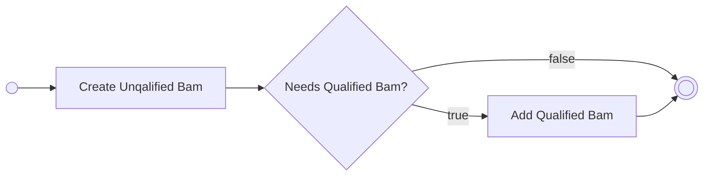
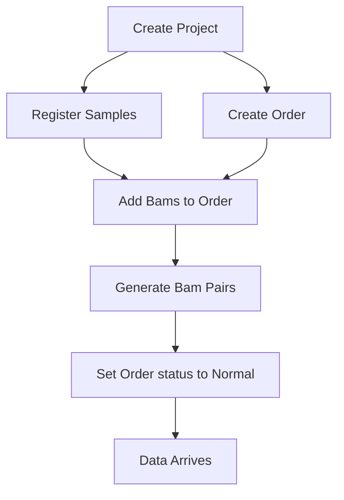

# Orders

In addition to the changes outlined in the [schema changes](/bam_refactor-api/schema),
RAPTR orders will need to be extended so that once an order is finalized, the
appropriate item records (bam, bam_pair, order_subject) are created.

Once an order is created, it will be placed in a "Draft" status. This will allow
us to create the default item records for the order (after a suite has been 
chosen) and have the user either accept the defaults or modify the items to fit
their needs.

## Bams

In general, one bam per sample should be sufficient for most analysis types, but
some types, such as xenocp, result in a new, separate bam record that is
generated using the original bam. The default bam for a sample should have a
qualifier of `-`, and a bam created for a specific analysis type should have that
type's name as its qualifier.

Previously, Samples have been linked to Orders indirectly via the
`sample_target_project_orders` table, but that is being replaced by a new table
named `bam_order`. Everything is driven by Orders, so a more direct link
between the two is both more efficient and makes more sense.

This new table also has two new columns:

- **do_analysis**: A boolean value indicating whether or not analyses should be
  run for this order on this bam. This value should be true for every bam in the
  order that is not a source bam for another bam in that same order.
- **do_nma**: A boolean value indicating whether or not non-mapping analysese
  (NMA) should be performed on this bam for this order. This should be true for
  unqualified bams (bams with a qualifier of "-").

## Bam Pairs

Since we require the user to pick a suite, we can infer based on the types
included in that suite and the samples that are associated with the order which
bam_pair records should be created by default. The
[Order creation endpoint](/bam_refactor-api/documentation/redoc-a45aec4f.html#tag/Order/paths/~1order/post)
accepts a boolean flag to allow for automatically creating these pairs, but it
is not possible to pass this endpoint custom pairs.

In order to specify specific pairs, the user will need to use the
[Add Bam Pairs to Order endpoint](/bam_refactor-api/documentation/redoc-a45aec4f.html#tag/Order/paths/~1order~1{order_id}~1bam_pair/post).
The UI that will be created for Orders in the RAPTR web application will allow
for modifying these pairs as well.

## Advancing to Normal

While an Order is in the "Draft" state, no analyses will be performed, but once
everything is ready, the Order will be updated to the `normal` status. This *can*
be done automatically at
[Order creation](/bam_refactor-api/documentation/redoc-a45aec4f.html#tag/Order/paths/~1order/post)
usin the `advance_to_normal` flag.

## Overall Workflow

