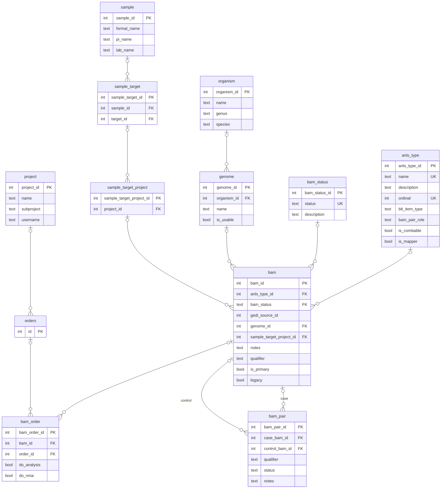

# Schema Changes

## Removing bam_tpl
The biggest change being made to the database schema is the removal of the
`bam_tpl` table. All of the useful columns from that table are being moved to
the `bam` table. These fields are: `sample_target_project_id`, `qualifier`,
`primary_bam_id`, and `legacy`.

Since `primary_bam_id` is a foreign key pointing to the `bam` table, it cannot
be brought over directly and is instead replaced with a new boolean field named
`is_primary`.

## Adding bam_order

Instead of connecting `bam` to `orders` indirectly through
`sample_target_project_order`, a new table is being created: `bam_order`. As
part of adding this table, `sample_target_project_order` will be dropped, and
all of its data will be migrated to `bam_order`

### Potential Concerns

- If either a `bam` or an order (`orders`) does not exist, then it may be difficult
to preserve the connection represented by `sample_target_project_order`.

## ER Diagram

